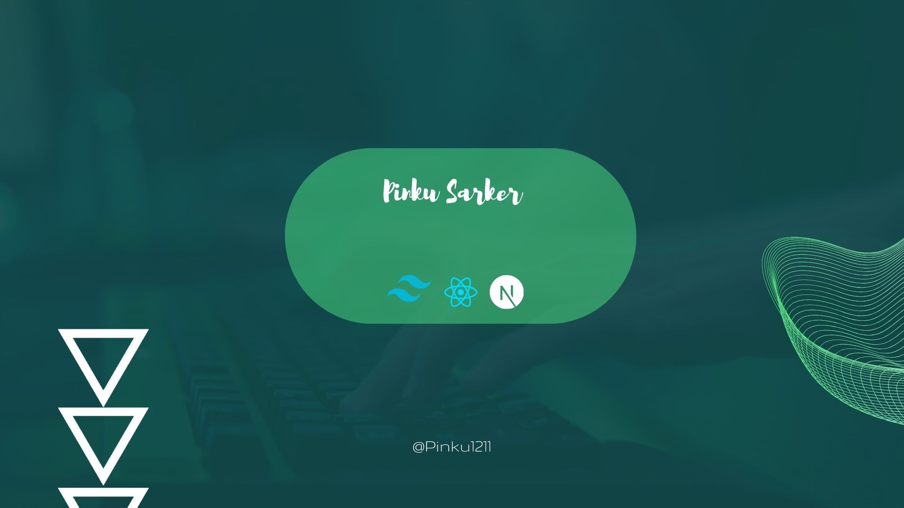

  

  

<h3 align="left" >Connect with me:</h3>

<h3 align="left">Languages and Tools:</h3>

          

- 🔭 I’m currently working **on a program in a learning platform**

- 🌱 I’m currently learning **Next.js**

- 📫 How to reach me **pinkukumarsarker@gmail.com**

- ⚡ Fun fact **I think I have very good sense of humor!😀**

